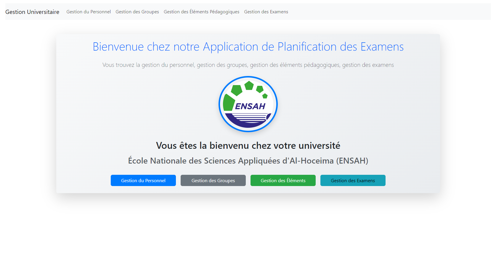
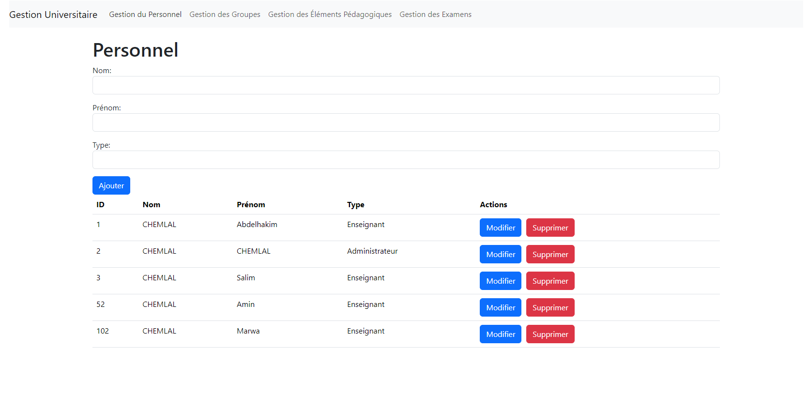
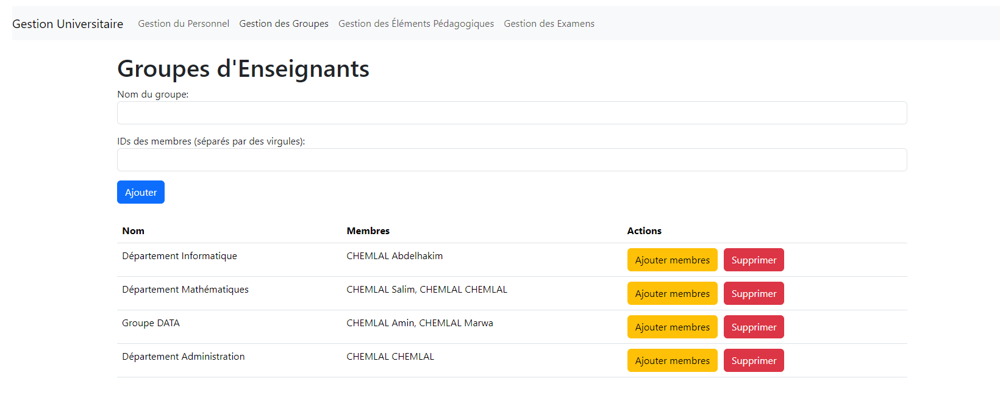
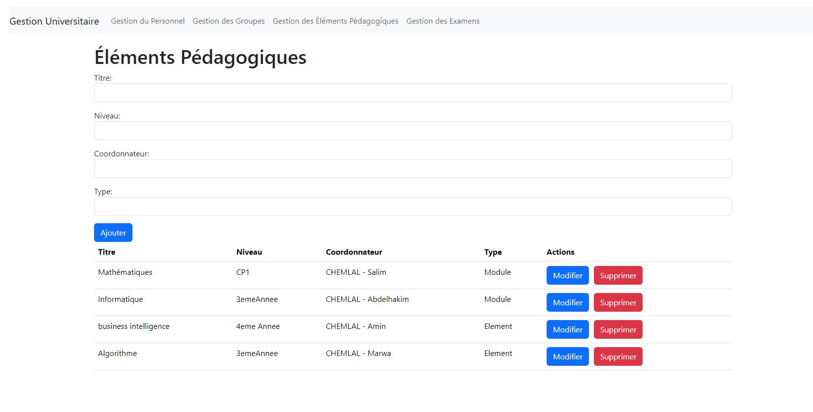
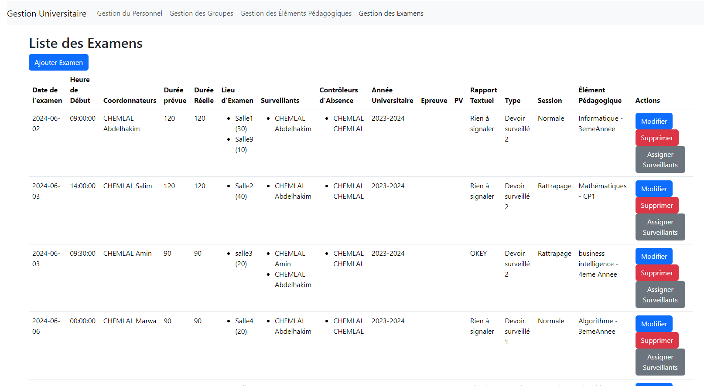

# Examen Management Application

This is a web application built with Angular for managing exams and assigning supervisors to exam rooms.

## Features

- Create, update, delete, and retrieve exams.
- Assign supervisors to exam rooms either randomly or by group.

## Technologies Used

- Angular
- TypeScript
- JavaScript
- npm

## Setup and Installation

1. Clone the repository.
2. Navigate to the project directory.
3. Run `npm install` to install dependencies.
4. Run `ng serve` to start the development server.

## Usage

Navigate to the application in your web browser. Use the form to select the mode of assignment and specify the number of supervisors per room. Click the "Assigner" button to assign supervisors based on your criteria.

## Contributing

Pull requests are welcome. For major changes, please open an issue first to discuss what you would like to change.

## License

[MIT](https://choosealicense.com/licenses/mit/)
# Interface of Examen Management Application :
     
     
     
